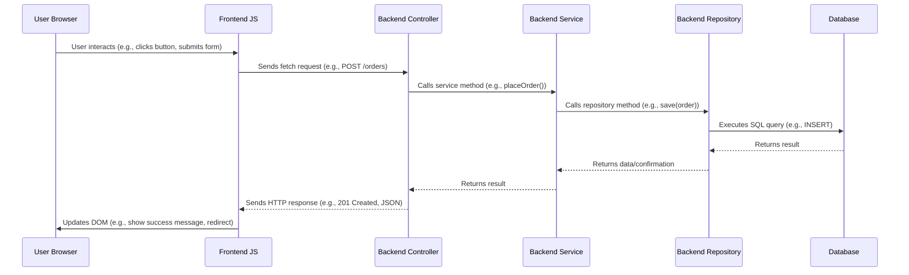

# NightFall POS 🌙 - Spring Boot + Static HTML POS Application

A simple, yet functional Point-of-Sale (POS) system designed for construction material suppliers, built with Spring Boot for the backend and static HTML/CSS/JS for the frontend.

## Overview

This project demonstrates a basic web application structure using modern Java technologies and straightforward frontend development. It allows users (Cashiers/Managers) to log in, view materials, place orders for customers, and view past orders with receipts.

## Components

### Backend (Spring Boot)

*   **Framework:** [Spring Boot 3.4.5](https://spring.io/projects/spring-boot) provides a robust foundation for building the RESTful API.
*   **Data Persistence:** [Spring Data JPA](https://spring.io/projects/spring-data-jpa) simplifies database interactions using repositories and entities.
*   **Database:** [PostgreSQL](https://www.postgresql.org/) is used as the relational database. The connection details (configured for Neon cloud PostgreSQL) are in `src/main/resources/application.properties`. `spring.jpa.hibernate.ddl-auto=update` allows Hibernate to automatically update the database schema based on entity definitions.
*   **API:** RESTful endpoints are defined in the `controller` package to handle requests from the frontend.
*   **Business Logic:** Services in the `service` package encapsulate the core application logic (e.g., placing an order, user authentication).
*   **Data Models:** Entities in the `model` package represent the database tables (User, Material, Order). Lombok annotations (`@Data`, `@Entity`, etc.) reduce boilerplate code.
*   **Repositories:** Interfaces in the `repository` package extend `JpaRepository` to provide CRUD operations for the entities.
*   **Initial Data:** `KaelApplication.java` includes a `CommandLineRunner` bean that populates the database with initial user and material data if the tables are empty.

### Frontend (Static HTML, Tailwind CSS, JavaScript)

*   **Structure:** Plain HTML files located in `src/main/resources/static/` define the user interface (`index.html`, `login.html`, `order.html`, `orders.html`, `receipt.html`).
*   **Styling:** [Tailwind CSS](https://tailwindcss.com/) (via CDN) is used for utility-first styling, providing a modern look and feel with the "Neo-Brutalist" aesthetic. Custom styles are minimal.
*   **Interactivity:** Vanilla JavaScript embedded within `<script>` tags in each HTML file handles:
    *   **API Interaction:** Using the `fetch` API to communicate with the Spring Boot backend (e.g., logging in, fetching materials, placing orders, retrieving order lists/details).
    *   **DOM Manipulation:** Dynamically updating the page content based on API responses or user actions (e.g., populating material dropdowns, displaying order totals, showing success/error messages).
    *   **Form Handling:** Capturing user input and validating forms before submission.
    *   **Basic Auth Simulation:** Using `sessionStorage` to store a simple login flag (`isLoggedIn`) for basic route protection (redirecting to `login.html` if not set). **Note:** This is *not* secure production authentication.
    *   **UI Feedback:** Displaying loading states and toast notifications.

## Project Structure

The project follows a standard Maven layout and organizes the backend code using a layered approach:

*   `src/main/java/com/kidaro/kael/`: Root package for Java source code.
    *   `controller/`: Handles incoming HTTP requests and maps them to service methods.
    *   `model/`: Defines JPA entities representing database tables.
    *   `repository/`: Spring Data JPA repository interfaces for database access.
    *   `service/`: Contains business logic and orchestrates repository calls.
    *   `KaelApplication.java`: Main Spring Boot application class and initial data loader.
*   `src/main/resources/`: Contains non-Java resources.
    *   `application.properties`: Configuration file for Spring Boot (database connection, server settings, etc.).
    *   `static/`: Directory for serving static web content (HTML, CSS, JS - though CSS/JS are mainly via CDN or inline).
*   `src/test/java/`: Contains unit and integration tests (basic context load test included).
*   `pom.xml`: Maven project configuration file, defining dependencies (Spring Boot starters, Lombok, PostgreSQL driver) and build settings.
*   `target/`: Directory where Maven places compiled code and packaged artifacts (ignored by Git).

## User Request Flow

1.  **User Interaction:** The user interacts with the HTML pages in their browser (e.g., fills the login form, selects materials on the order page).
2.  **Frontend JS:** JavaScript captures the user action and makes an asynchronous `fetch` request to the appropriate backend API endpoint (e.g., `POST /auth/login`, `GET /materials`, `POST /orders`).
3.  **Backend Controller:** The Spring Boot `RestController` matching the request path receives the request.
4.  **Backend Service:** The controller calls the relevant `Service` method to perform the business logic (e.g., validate credentials, fetch data from the database, update stock, save new order).
5.  **Backend Repository:** The service interacts with `JpaRepository` interfaces to perform database operations (querying, saving, updating entities).
6.  **Backend Response:** The controller receives the result from the service and sends an HTTP response (usually JSON data or an HTTP status code) back to the browser.
7.  **Frontend JS:** The JavaScript `fetch` callback receives the response, processes the data (if any), and updates the HTML DOM to reflect the changes (e.g., shows a success message, redirects the user, displays the order list).
8.  **User Sees Update:** The user sees the updated UI in their browser.



## Setup and Running

### Prerequisites

*   **Java Development Kit (JDK):** Version 21 or later.
*   **Apache Maven:** To build and run the project.
*   **PostgreSQL Database:** A running instance accessible to the application. You can use a local installation, Docker, or a cloud service like Neon (as configured in `application.properties`).

### Configuration

1.  **Database:**
    *   Ensure you have a PostgreSQL database created.
    *   Update the `spring.datasource.url`, `spring.datasource.username`, and `spring.datasource.password` properties in `src/main/resources/application.properties` to match your database connection details. The current configuration points to a Neon cloud database.

### Running the Application

1.  **Navigate:** Open a terminal or command prompt in the project's root directory (`d:\Development\Satoru\kael\kael\`).
2.  **Run with Maven:** Execute the following Maven command:
    ```bash
    mvn spring-boot:run
    ```
    (Use `mvnw.cmd spring-boot:run` on Windows Command Prompt)
3.  **Access:** Once Spring Boot starts (look for `Tomcat started on port(s): 8080`), open your web browser and navigate to `http://localhost:8080`.

You should see the landing page (`index.html`). You can then navigate to the login page (`/login.html`) and use the default credentials (cashier/pass or manager/adminpass) seeded by the `CommandLineRunner`.